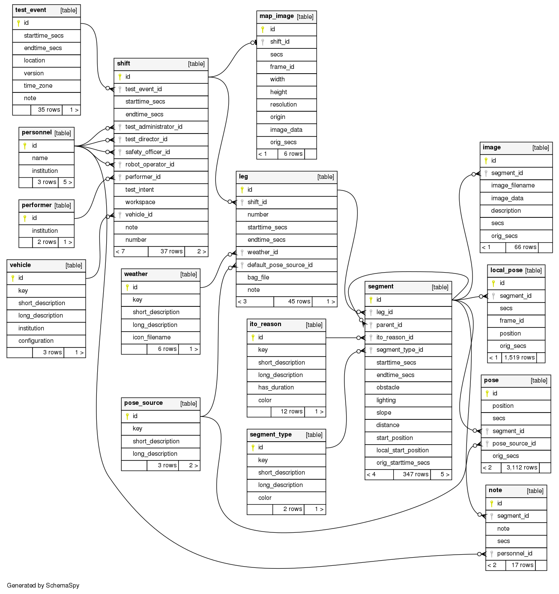

# Field Test Tool (FTT)

The purpose of this tool is to monitor and analyze the switching events between autonomous mode and manual mode on autonomous ground vehicles. This is done by collecting relevant data from the robot's ROS environment, alongside context data provided by users.
The collected data is processed by an automatic report generator, which aims to help the manufacturer, the project manager and the customer to analyze software issues in certain enviroments.
This project includes a web GUI for users to input context data as well as allow them to create new log entries in the database.

The software allows you to:

- Save ROS-messages to a database.
- Analyze and view the collected data by generating reports (PDF) from the database.

The web GUI further allows you to:

- Create and edit log entries (test events, shifts, legs and segments).
- Create and edit resource entries (performers, personnel, pose sources and vehicles).
- Set reasons for Auto->Manual transitions (ITO Reasons).
- Append segment notes and images.
- View a list of ITO segments and a map with the geolocation data.

<br/><br/>

## _Relevant Info_

### **Database Info**

|               |          |
| ------------- | -------- |
| Database Name | ftt      |
| Username      | postgres |
| Password      | postgres |

<br/><br/>

### **Database Schema**



<br/><br/>

### **Database Server API**

| Endpoint      | Description                     | Supported HTTP methods |
| ------------- | ------------------------------- | ---------------------- |
| /test_event   | Interface to test_event table   | GET, POST, PUT         |
| /shift        | Interface to shift table        | GET, POST, PUT         |
| /leg          | Interface to leg table          | GET, POST, PUT         |
| /segment      | Interface to segment table      | GET, POST, PUT         |
| /pose         | Interface to pose table         | GET, POST              |
| /note         | Interface to note table         | GET, POST, PUT, DELETE |
| /image        | Interface to image table        | GET, POST, DELETE      |
| /segment_type | Interface to segment_type table | GET                    |
| /ito_reason   | Interface to ito_reason table   | GET                    |
| /weather      | Interface to weather table      | GET                    |
| /pose_source  | Interface to pose_source table  | GET, POST, PUT, DELETE |
| /performer    | Interface to performer table    | GET, POST, PUT, DELETE |
| /personnel    | Interface to personnel table    | GET, POST, PUT, DELETE |
| /vehicle      | Interface to vehicle table      | GET, POST, PUT, DELETE |
| /index.html   | Main GUI.                       | GET                    |
| /config.html  | Configuration GUI.              | GET                    |

<br/><br/>

### **ROS-packages**

| Name              | Description                                         |
| ----------------- | --------------------------------------------------- |
| ftt_ros_interface | Robot interface to FTT-database through a JSON API. |

<br/><br/>

### **Web GUI HTML files**

| File        | Description                                                |
| ----------- | ---------------------------------------------------------- |
| index.html  | Main page. View, editing and creation of log-related data. |
| config.html | Creation, editing and removal of test resources.           |

<br/><br/>

### **Required Libraries and Resources**

The following libraries and resources are needed for this project. They are shown alongside their respective license.

| Name                       | License                                 | URL                                                                |
| -------------------------- | --------------------------------------- | ------------------------------------------------------------------ |
| Python Standard Library    | PSF License                             | https://docs.python.org/2/license.html                             |
| rospy                      | BSD License                             | https://wiki.ros.org/rospy                                         |
| sensor_msgs                | BSD License                             | http://wiki.ros.org/sensor_msgs                                    |
| industrial_msgs            | BSD License                             | http://wiki.ros.org/industrial_msgs                                |
| cv_bridge                  | BSD License                             | http://wiki.ros.org/cv_bridge                                      |
| requests                   | Apache License Version 2.0              | https://github.com/psf/requests/blob/master/LICENSE                |
| Pillow                     | HPND License                            | https://github.com/python-pillow/Pillow/blob/master/LICENSE        |
| psycopg2                   | GNU Lesser General Public License       | https://www.psycopg.org/license/                                   |
| Flask                      | BSD-3-Clause License                    | https://github.com/pallets/flask/blob/master/LICENSE.rst           |
| Flask-restful              | BSD-3-Clause License                    | https://github.com/flask-restful/flask-restful/blob/master/LICENSE |
| Flask-cors                 | MIT License                             | https://github.com/corydolphin/flask-cors/blob/master/LICENSE      |
| LXML                       | BSD-3-Clause License                    | https://github.com/lxml/lxml/blob/master/LICENSE.txt               |
| jinja2                     | BSD-3-Clause License                    | https://github.com/pallets/jinja/blob/master/LICENSE.rst           |
| parse                      | MIT License                             | https://github.com/r1chardj0n3s/parse/blob/master/LICENSE          |
| pyproj                     | MIT License                             | https://github.com/pyproj4/pyproj/blob/master/LICENSE              |
| Leaflet                    | 2-clause BSD License                    | https://github.com/Leaflet/Leaflet/blob/master/LICENSE             |
| OpenStreetMap<sup>\*</sup> | Open Data Commons Open Database License | https://www.openstreetmap.org/copyright                            |
| Google Material Icons      | Apache License Version 2.0              | http://www.apache.org/licenses/LICENSE-2.0.txt                     |
| Webpack                    | MIT License                             | https://github.com/webpack/webpack/blob/master/LICENSE             |
| Webpack CLI                | MIT License                             | https://github.com/webpack/webpack-cli/blob/master/LICENSE         |
| Webpack Dev Server         | MIT License                             | https://github.com/webpack/webpack-dev-server/blob/master/LICENSE  |
| HTML Webpack Plugin        | MIT License                             | https://github.com/jantimon/html-webpack-plugin/blob/main/LICENSE  |

<span style="font-size:smaller">\* © OpenStreetMap contributors. Base map and data from OpenStreetMap and OpenStreetMap Foundation.</span>

<br/><br/>

## _System requirements_

- Ubuntu 16.04 and ROS Kinetic OR Ubuntu 18.04 and ROS Melodic.
- Current version of a web browser, at least<sup>\*</sup>:
  - Chrome 89+
  - Firefox 86+
  - Safari 14+

<span style="font-size:smaller">\* Older destop versions might also work fine, but mobile ones probably won't.</span>
<br/><br/>

## _Installation_

### **Installation of Python libraries**

```bash
sudo apt-get install build-essential python-psycopg2 python-pyproj python-catkin-tools python-jinja2 python-parse python-lxml
sudo python -m pip install requests Pillow Flask flask-restful
sudo python -m pip install -U flask-cors
```

### **Installation of LaTex and libraries**

```bash
sudo apt-get install texlive texlive-lang-german texlive-doc-de texlive-latex-extra texmaker texlive-fonts-extra texlive-xetex latex-xcolor
```

### **Installation of the Field Test Tool**

```bash
cd <ros_workspace>/src
git clone https://github.com/fkie/field_test_tool.git
catkin build
```

### **Installation of PostgreSQL server**

```bash
sudo apt-get install postgresql postgresql-client postgis
```

### **Configuration of PostgreSQL**

Change to PostgreSQL interactive terminal (recognizable by postgres=#):

```bash
sudo -u postgres psql
```

Set password for user postgres:

```psql
\password postgres
postgres
postgres
```

Create FTT database:

```psql
CREATE DATABASE ftt;
```

Show all databases (optional):

```psql
\l
```

Change to database ftt and show it's contents:

```psql
\c ftt
\dt
```

Enable postgis and postgis_topology extensions for the current database (ftt):

```psql
CREATE EXTENSION postgis;
CREATE EXTENSION postgis_topology;
```

Quit Postgres interactive terminal:

```psql
\q
```

Create the database schema and fill some tables with the required values:

```bash
psql -U postgres -h localhost ftt <ros_workspace>/src/field_test_tool/ftt_database/postgres/ftt_schema.sql
psql -U postgres -h localhost ftt <ros_workspace>/src/field_test_tool/ftt_database/postgres/setup_queries.pgsql
```

Alternative: If postgres server is on a different host:

```bash
psql -h hostname -d ftt -U postgres -p 5432 -a -q -f <ros_workspace>/src/field_test_tool/ftt_database/postgres/ftt_schema.sql ftt
psql -h hostname -d ftt -U postgres -p 5432 -a -q -f <ros_workspace>/src/field_test_tool/ftt_database/postgres/setup_queries.sql ftt
```

### **Installation texmaker (optional)**

Texmaker is an editor for editing LaTeX files.

```bash
sudo apt-get install texmaker
```

### **Installation pgAdmin III (optional)**

PgAdmin is a management software for the PostgresSQL-database server.

```bash
sudo apt-get install pgadmin3
```

### **Installation of the FTT Web GUI**

Once cloned, the repository already contains all the files ready for the web server to serve the web application. **However**, to further develop, make changes to the JavaScript code or use the application in offline mode, certain tools/libraries will be needed and the following steps will walk you through the installation process.

The tools will basically allow you to **build** the separate JavaScript files into a single script, which could then also be optimized for browser execution. The download of the extra libraries will allow **offline** execution of the application.

**Alternatively**, the whole application can be made to work **_without_** the extra tools or libraries. Beware though, that this means loosing the optimization and script merging capabilities as well as offline usage.

To work without the extra tools, respectively change the following lines in index.html and config.html:

```html
<script src="assets/scripts/index.js" defer type="module"></script>
```

```html
<script src="assets/scripts/config.js" defer type="module"></script>
```

For:

```html
<script src="src/index.js" defer type="module"></script>
```

```html
<script src="src/config.js" defer type="module"></script>
```

Otherwise, proceed with the installation steps below.
<br/><br/>

#### **_Installation of Node.js_**

Install the latest version of Node.js for you machine from nodesjs.org. This will give you access to the **_npm_** package manager needed for the next steps.
<br/><br/>

#### **_Installation of npm libraries_**

The following npm libraries (and their dependencies) will be installed:

| Name                       | Description                                 |
| -------------------------- | ------------------------------------------- |
| ESLint v7.17.0             | Linting for your JS code.                   |
| Html Webpack Plugin v4.5.1 | Webpack plugin to work with multiple HTMLs. |
| Webpack v4.46.0            | Script bundling and workflow managing.      |
| Webpack CLI v3.3.9         | Webpack set of commands for developing.     |
| Webpack Dev Server v3.11.2 | Webpack simple serving for applications.    |
| Material Design Icons      | Offline use of Google icons.                |
| Leaflet                    | Offline use of Leaflet map viewer.          |

<br/><br/>
To install them, simply navigate to your project directory and run the following npm command:

```bash
cd <ros_workspace>/src/field_test_tool/ftt_web_interface

npm install
```

#### **_Installation of ESLint (optional for VS Code)_**

If you're working with VS Code, linting can be made available for this project to help with development. To do this, install the ESLint extension from the extensions tab of VSCode and enable it.

Linting will be shown according to the rules set in the _.eslintrc.json_ file.
<br/><br/>

#### **_Useful npm commands_**

From the project directory _<ros_workspace>/src/field_test_tool/ftt_web_interface_ the following npm commands are conveniently available:

| Command            | Description |
| ------------------ | ----------- |
| npm run build      | Bundles the different scripts and builds index.js and config.js under the assets/scripts folder. |
| npm run build:dev  | Bundles the scripts and starts a development server to serve the applications at _localhost:8080_. </br>**Warning**: Since the web app is meant to be served from the same server as the database API,</br>the app won't work properly unless the server address is manually changed in _src/utility/ServerInterface.js_. |
| npm run build:prod | Just like build, but the built scripts are also optimized for production. |

<br/><br/>

## _Execution_

### **FTT database API**

The following commands starts the database JSON server API:

```bash
cd <ros_workspace>/src/field_test_tool/ftt_database/scripts/

python api.py
```

### **FTT ROS to API interface**

The following command launches the ROS data collector for sending the operation mode, ros images, GPS position, local map and base link position data.

```bash
roslaunch ftt_ros_interface ros2api.launch <args>
```
The launched ROS node will subscribe to the topics configured in the launchfile arguments (explained below) and additionally offer a debug topic for downloading the images stored in the database:
- /download_image

It takes a message of type std_msgs/Int32. Its value being the segment ID.

### **FTT web GUI**

After running the FTT server API, visit http://localhost:5000/ from your web browser.

### **PDF-Report generator**

The following commands will run the report generator. The output PDF report will be available at _<ros_workspace>/src/field_test_tool/ftt_report_generator/build/<configured_report_name>.pdf_. The report configuration options are explained below.

```bash
cd <ros_workspace>/src/field_test_tool/ftt_report_generator/src/

python db2rep.py <path_to_config_file> (e.g. ../config/2021_fkie_test.xml)
```

<br/><br/>

## _Launchfile arguments_

The ROS interface launchfile (ros2api.launch) has arguments that should be set, either from the command line, or from another launchfile importing it. These arguments are explained below.

| Parameter Name         | Description                                                                      |
| ---------------------- | -------------------------------------------------------------------------------- |
| GPS_POSITION_TOPIC     | ROS topic for GPS position data of type _sensor_msgs/NavSatFix_.                 |
| ROBOT_MODE_TOPIC       | ROS topic for robot operating mode of type _industrial_msgs/RobotMode_.          |
| IMAGE_RAW_TOPIC        | ROS topic for robot frontal camera images of type _sensor_msgs/Image_.           |
| IMAGE_COMPRESSED_TOPIC | ROS topic for robot frontal camera images of type _sensor_msgs/CompressedImage_. |
| SEND_POSE_TIMEOUT      | Parameter to set interval time for sending position data to the database.        |
| SERVER_ADDRESS         | Parameter to set the Database API server IP and port.                            |
| SAVE_IMAGE_DIR         | Parameter to set the directory for images downloaded from the node.              |

<br/><br/>

## _Report Generator Configuration File_

The report generator script requires an XML file with the following structure:

```xml
<testevent>

  <resource tile_server = "<server_dir>" zoom_level = "<integer>"/>

  <postgis host = "localhost" dbname="ftt" patch_schema="yes" user ="postgres" password = "postgres"/>

  <report name="<report_name>" version="<version>">
    <test_event id="<test_event_id>" min_dur="<min_duration_in_hours>"/>
    <recipient name="<name>" address_l1="<address_line_1>" address_l2="<address_line_2>"/>
    <creator name="<name>" address_l1="<address_line_1>" address_l2="<address_line_2>"/>
    <logos top_logo_path = "<path_to_front_page_top_logo>" bottom_logo_path = "<path_to_front_page_bottom_logo>"/>
  </report>

</testevent>
```

Most of the parameters are self-explanatory, but the following should be noted:

- The **_server_dir_** parameter expects either an IP or a name that can be converted to one through the DNS. The tile server must provide an API with the URL format **server_dir/{zoom}/{xtile}/{ytile}** to retrieve map tiles. An example would be _<span>a.tile.openstreetmap.org</span>_.
- The **_zoom_level_** parameter sets the zoom level used for fetching the tiles from the tile server.
- The **_report_name_** and **_version_** parameters are simply for the text to be displayed on the front page of the report.
- The **_test_event_id_** parameter specifies the test event for which the information will be processed and written to the report.
- The **_min_dur_** parameter is simply used to set a minimum length for the timeline generated in the report and the number should be specified in hours.

## _Offline Usage of the web GUI_

Completing the installation steps for the web GUI enables the offline usage of the application on your machine, the one **exception** being the tile server.

A tile server is needed for the leaflet map viewer in the FTT. By default, OpenStreetMap is used. Without internet access, a local tile server must be configured. A guide on how to do this can be found on:

- https://switch2osm.org/serving-tiles/manually-building-a-tile-server-18-04-lts

A docker container is also available on:

- https://github.com/Overv/openstreetmap-tile-server
