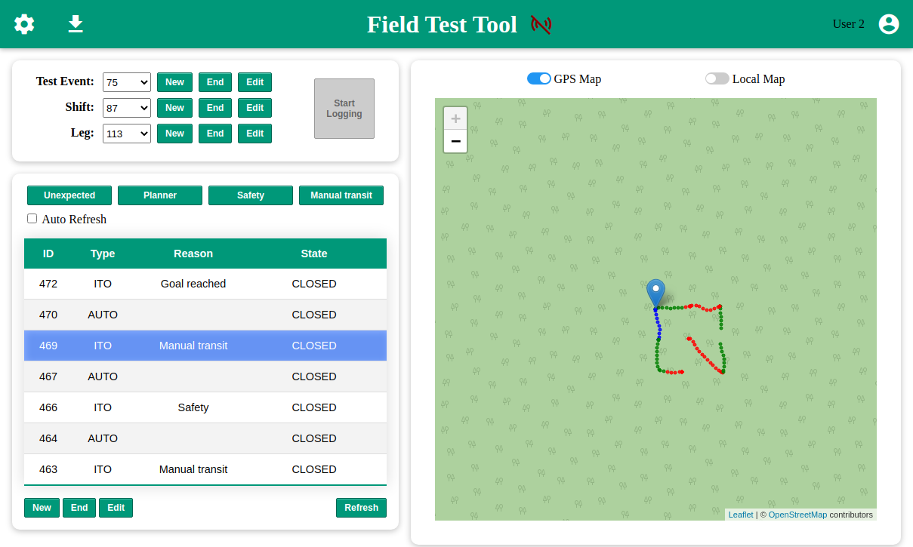

# Field Test Tool (FTT)

The purpose of this tool is to monitor and analyze the switching events between autonomous mode and manual mode on autonomous ground vehicles. This is done by collecting relevant data from the robot's ROS environment, alongside context data provided by users.
The collected data is processed by an automatic report generator, which aims to help the manufacturer, the project manager and the customer to analyze software issues in certain enviroments.
<br/><br/>

## _1. Description_

The Field Test Tools comprises five software modules:
- A PostgreSQL database with PostGIS extension. 
- An automatic report generator out of the stored data.
- A web server that exposes a JSON API for the database and report generator.
- A ROS interface to the server API and the web user interface.
- A web user interface to the server API and the ROS interface.
<br/><br/>

### **1.1. Database**

A PostgreSQL database with PostGIS extension is used to store the relevant data. The databse schema is shown in Figure 1. The robot's position, operating mode, images from on-board or off-board cameras and user notes are stored under a hierarchical logging structure representing the trial instance (Test Event), test attempt (Shift), and route section (Leg). Each trajectory under a single operating mode comprises a Segment entry.

<figure>
  
  <figcaption>Figure 1. Database schema.</figcaption>
</figure>
<br/><br/>

### **1.2. Report generator**
A python script that reads and processes the stored data, then generates and compiles a LaTeX report. The report includes an overview of the robot's path and a timeline of the operating modes, as shown in Figures 2 and 3. Details for each individual segment (path section) are also annotated.

<figure>
  
  <figcaption>Figure 2. FTT report overview (map).</figcaption>
</figure>
<br/><br/>

<figure>
  
  <figcaption>Figure 3. FTT report overview (timeline).</figcaption>
</figure>
<br/><br/>

### **1.3. Web server**

A python script implements a JSON API with the common requests (POST, PUT, GET) to interact with the database tables through HTTP messages. It also serves the main HTML pages and provides an interface to call and get the automatically generated report.
<br/><br/>

### **1.4. ROS interface**

A ROS node that fetches the following data to create database entries:

| Data            | Type                                             |
| --------------- | ------------------------------------------------ |
| Operation mode  | industrial_msgs/RobotMode                        |
| GPS position    | sensor_msgs/NavSatFix                            |
| Local position  | TF (map_frame -> robot_frame)                    |
| Environment map | nav_msgs/OccupancyGrid                           |
| Camera Image    | sensor_msgs/Image or sensor_msgs/CompressedImage |


Aditionally, the node advertises the following services to interact with the web user interface:

| Service          | Description                                          |
| ---------------- | ---------------------------------------------------- |
| /set_ftt_logging | Starts/stops sending robot data to the database      |
| /get_ftt_logging | Returns the current logging status (active/inactive) |
| /save_ftt_params | Write the node parameters to the config file         |

<br/><br/>

### **1.5. Web user interface**

A JavaScript web application that implements a graphical user interface to create new logging instances and append valuable context information. Feedback on the stored robot position data and operating mode is also displayed.
Figures 4 and 5 show an overview of the FTT web GUI displaying GPS and local position, respectively. The data was generated using Clearpath's Husky ROS stack.

<figure>
  
  <figcaption>Figure 4. FTT web GUI overview with GPS data.</figcaption>
</figure>
<br/><br/>

<figure>
  
  <figcaption>Figure 5. FTT web GUI overview with local data.</figcaption>
</figure>
<br/><br/>

## _2. Acknowledgements_

The following libraries and resources are needed for this project. They are shown alongside their respective license.

| Name                       | License                                 | URL                                                                |
| -------------------------- | --------------------------------------- | ------------------------------------------------------------------ |
| Python Standard Library    | PSF License                             | https://docs.python.org/2/license.html                             |
| rospy                      | BSD License                             | https://wiki.ros.org/rospy                                         |
| sensor_msgs                | BSD License                             | http://wiki.ros.org/sensor_msgs                                    |
| industrial_msgs            | BSD License                             | http://wiki.ros.org/industrial_msgs                                |
| cv_bridge                  | BSD License                             | http://wiki.ros.org/cv_bridge                                      |
| requests                   | Apache License Version 2.0              | https://github.com/psf/requests/blob/master/LICENSE                |
| ruamel.yaml                | MIT License                             | https://sourceforge.net/p/ruamel-yaml/code/ci/default/tree/LICENSE |
| Pillow                     | HPND License                            | https://github.com/python-pillow/Pillow/blob/master/LICENSE        |
| psycopg2                   | GNU Lesser General Public License       | https://www.psycopg.org/license/                                   |
| Flask                      | BSD-3-Clause License                    | https://github.com/pallets/flask/blob/master/LICENSE.rst           |
| Flask-restful              | BSD-3-Clause License                    | https://github.com/flask-restful/flask-restful/blob/master/LICENSE |
| Flask-cors                 | MIT License                             | https://github.com/corydolphin/flask-cors/blob/master/LICENSE      |
| LXML                       | BSD-3-Clause License                    | https://github.com/lxml/lxml/blob/master/LICENSE.txt               |
| jinja2                     | BSD-3-Clause License                    | https://github.com/pallets/jinja/blob/master/LICENSE.rst           |
| parse                      | MIT License                             | https://github.com/r1chardj0n3s/parse/blob/master/LICENSE          |
| pyproj                     | MIT License                             | https://github.com/pyproj4/pyproj/blob/master/LICENSE              |
| Leaflet                    | 2-clause BSD License                    | https://github.com/Leaflet/Leaflet/blob/master/LICENSE             |
| OpenStreetMap<sup>\*</sup> | Open Data Commons Open Database License | https://www.openstreetmap.org/copyright                            |
| Google Material Icons      | Apache License Version 2.0              | http://www.apache.org/licenses/LICENSE-2.0.txt                     |
| Webpack                    | MIT License                             | https://github.com/webpack/webpack/blob/master/LICENSE             |
| Webpack CLI                | MIT License                             | https://github.com/webpack/webpack-cli/blob/master/LICENSE         |
| Webpack Dev Server         | MIT License                             | https://github.com/webpack/webpack-dev-server/blob/master/LICENSE  |
| HTML Webpack Plugin        | MIT License                             | https://github.com/jantimon/html-webpack-plugin/blob/main/LICENSE  |
| Easeljs                    | MIT License                             | https://github.com/CreateJS/EaselJS/blob/master/LICENSE.txt        |
| Roslibjs                   | BSD License                             | https://github.com/RobotWebTools/roslibjs/blob/develop/LICENSE     |
| Ros2djs                    | BSD License                             | https://github.com/RobotWebTools/ros2djs/blob/develop/LICENSE      |

<span style="font-size:smaller">\* © OpenStreetMap contributors. Base map and data from OpenStreetMap and OpenStreetMap Foundation.</span>

<br/><br/>

## _3. System requirements_

- Ubuntu 18.04 and ROS Melodic.
- Current version of a web browser, at least<sup>\*</sup>:
  - Chrome 89+
  - Firefox 86+
  - Safari 14+

<span style="font-size:smaller">\* Older destop versions might also work fine, but mobile ones probably won't.</span>
<br/><br/>

## _4. Installation_

### **4.1. Installation of Python libraries**

```bash
sudo apt-get install build-essential python-pyproj python-catkin-tools python-jinja2 python-parse python-lxml python-ruamel.yaml
sudo python -m pip install -U requests Pillow Flask flask-restful flask-cors psycopg2
```

### **4.2. Installation of LaTeX and libraries**

```bash
sudo apt-get install texlive texlive-lang-german texlive-latex-extra texmaker texlive-fonts-extra texlive-xetex
```

### **4.3. Installation of the Field Test Tool**

```bash
cd <ros_workspace>/src
git clone https://github.com/fkie/field_test_tool.git
rosdep install --from-paths field_test_tool/ --ignore-src
catkin build
```

### **4.4. Installation of PostgreSQL server**

```bash
sudo apt-get install postgresql postgresql-client postgis
```

### **4.5. Configuration of PostgreSQL**

Change to PostgreSQL interactive terminal (recognizable by postgres=#):

```bash
sudo -u postgres psql
```

Set password for user postgres:

```psql
\password postgres
postgres
postgres
```

Create FTT database:

```psql
CREATE DATABASE ftt;
```

Show all databases (optional):

```psql
\l
```

Change to database ftt and show it's contents:

```psql
\c ftt
\dt
```

Enable postgis and postgis_topology extensions for the current database (ftt):

```psql
CREATE EXTENSION postgis;
CREATE EXTENSION postgis_topology;
```

Quit Postgres interactive terminal:

```psql
\q
```

Create the database schema and fill some tables with the required values:

```bash
cd <ros_workspace>/src
psql -U postgres -h localhost -d ftt -a -f field_test_tool/ftt_database/postgres/ftt_schema.sql
psql -U postgres -h localhost -d ftt -a -f field_test_tool/ftt_database/postgres/setup_queries.pgsql
```

Alternative: If postgres server is on a different host:

```bash
cd <ros_workspace>/src
psql -h hostname -d ftt -U postgres -p 5432 -a -q -f field_test_tool/ftt_database/postgres/ftt_schema.sql ftt
psql -h hostname -d ftt -U postgres -p 5432 -a -q -f field_test_tool/ftt_database/postgres/setup_queries.sql ftt
```

### **4.6. Installation texmaker (optional)**

Texmaker is an editor of LaTeX files.

```bash
sudo apt-get install texmaker
```

### **4.7. Installation pgAdmin III (optional)**

PgAdmin is a management software for the PostgreSQL-database.

```bash
sudo apt-get install pgadmin3
```

### **4.8. Installation of the FTT Web GUI**

Once cloned, the repository already contains all the files ready for the web server to serve the web application. **However**, to further develop, make changes to the JavaScript code or use the application in offline mode, certain tools/libraries will be needed and the following steps will walk you through the installation process.

The tools will basically allow you to **build** the separate JavaScript files into a single script, which could then also be optimized for browser execution. The download of the extra libraries will allow **offline** execution of the application.

**Alternatively**, the whole application can be made to work **_without_** the extra tools or libraries. Beware though, that this means loosing the optimization and script merging capabilities as well as offline usage.

To work without the extra tools, respectively change the following lines in index.html and config.html:

```html
<script src="assets/scripts/index.js" defer type="module"></script>
```

```html
<script src="assets/scripts/config.js" defer type="module"></script>
```

For:

```html
<script src="src/index.js" defer type="module"></script>
```

```html
<script src="src/config.js" defer type="module"></script>
```

Otherwise, proceed with the installation steps below.
<br/><br/>

#### **_4.8.1. Installation of Node.js_**

Install the latest version of Node.js for you machine from https://nodejs.org. This will give you access to the **_npm_** package manager needed for the next steps.
<br/><br/>

#### **_4.8.2. Installation of npm libraries_**

The following npm libraries (and their dependencies) will be installed:

| Name                       | Description                                 |
| -------------------------- | ------------------------------------------- |
| ESLint v7.17.0             | Linting for your JS code.                   |
| Html Webpack Plugin v4.5.1 | Webpack plugin to work with multiple HTMLs. |
| Webpack v4.46.0            | Script bundling and workflow managing.      |
| Webpack CLI v3.3.9         | Webpack set of commands for developing.     |
| Webpack Dev Server v3.11.2 | Webpack simple serving for applications.    |
| Material Icons             | Offline use of Google icons.                |
| Leaflet                    | Offline use of Leaflet map viewer.          |
| Easeljs                    | Offline use of Easeljs graphics library.    |

To install them, simply navigate to your project directory and run the following npm command:

```bash
cd <ros_workspace>/src/field_test_tool/ftt_web_interface

npm install
```

#### **_4.8.3. Installation of ESLint (optional for VS Code)_**

If you're working with VS Code, linting can be made available for this project to help with development. To do this, install the ESLint extension from the extensions tab of VSCode and enable it.

Linting will be shown according to the rules set in the _.eslintrc.json_ file.
<br/><br/>

#### **_4.8.4. Useful npm commands_**

From the project directory _<ros_workspace>/src/field_test_tool/ftt_web_interface_ the following npm commands are conveniently available:

| Command            | Description |
| ------------------ | ----------- |
| npm run build      | Bundles the different scripts and builds index.js and config.js under the assets/scripts folder. |
| npm run build:dev  | Bundles the scripts and starts a development server to serve the applications at _localhost:8080_. </br>**Warning**: Since the web app is meant to be served from the same server as the database API,</br>the app won't work properly unless the server address is manually changed in _src/utility/ServerInterface.js_. |
| npm run build:prod | Just like build, but the built scripts are also optimized for production. |

<br/><br/>

## _5. Execution_

### **5.1. FTT server**

The following commands starts the web server:

```bash
cd <ros_workspace>/src/field_test_tool/ftt_server/scripts/

python api.py
```

### **5.2. FTT ROS interface**

The following command launches the ROS data collector for sending the operation mode, ros images, GPS position, local map and base link position data.

```bash
roslaunch ftt_ros_interface ftt_ros.launch
```
The launch file will load the parameters in the YAML file of the package's configuration folder (details below) and then run the ROS node.
This node will initially only advertise three configuration services (_/set_ftt_logging_, _/get_ftt_logging_, _/save_ftt_params_) and subscribe to two debug topics (_download_image_, _download_map_).

The service "/set_ftt_logging" is used to start or stop the POSTing of data to the FTT server/database, the service "/get_ftt_logging" returns the current state of logging activity (active: true or inactive: false), and "/save_ftt_params" can be used to store the - potentially updated - node's parameters in the ROS parameters server, back to the YAML configuration file.

| Service          | Type             |
| ---------------- | ---------------- |
| /set_ftt_logging | std_srvs/SetBool |
| /get_ftt_logging | std_srvs/Trigger |
| /save_ftt_params | std_srvs/Trigger |

Once the logging is activated, the node's parameters are read, the subscribers for the robot data are created and the POSTing to the FTT server starts executing. Specifically, the following topics are subscribed (**Note**: the topic names are specified in the node's parameters).

| Topic            | Type                        |
| ---------------- | --------------------------- |
| robot_mode       | industrial_msgs/RobotMode   |
| robot_position   | sensor_msgs/NavSatFix       |
| Environment map  | nav_msgs/OccupancyGrid      |
| image_raw        | sensor_msgs/Image           |
| image_compressed | sensor_msgs/CompressedImage |

Additionally, a TF listener is started to get the robot's position (_robot_frame_) in the local coordinate frame (_map_frame_).

As for the aforementioned debug topics, "download_image" triggers a GET request to the server for all images stored under the segment ID specified in the message data, then downloads them to the "Pictures" folder of the home directoy. Similarly, "download_map" fetches the stored map for the given shift ID in the message data.

| Debug Topic    | Type           |
| -------------- | -------------- |
| download_image | std_msgs/Int32 |
| download_map   | std_msgs/Int32 |


#### **5.2.1 FTT ROS interface extras**

A second utility ROS node is provided, called robotModePublisher. This node subscribes to two velocity command topics (of type _geometry_msgs/TwistStamped_), one expected to come from the autonomous navigation stack and the other from a joystick interpreter. It then identifies the operation mode and publishes messages of type indutrial_msgs/RobotMode accordingly. The autonomous mode is flagged at the arrival of autonomous command messages. The publised message switches to manual mode the moment a non-zero joystick command message arrives. After joystick messages stop, a fixed time (parameter) must elapse before returning to the autonomous mode if navigation commands keep being received. This timeout routine is implemented in order to prevent unwanted switching between modes.

To launch the robotModePublisher, the following command can be used:
```bash
roslaunch ftt_ros_interface robot_mode_publisher.launch <args>
```

### **5.3. FTT web GUI**

After running the FTT server API, visit http://localhost:5000/ from your web browser (alternatively, the IP address of the machine running the server). Usage instructions can be found under the _docs_ directory of this repository.
<br/><br/>

### **5.4. PDF-Report generator**

The following commands will run the report generator. The output PDF report will be available at _<ros_workspace>/src/field_test_tool/ftt_report_generator/build/report.pdf_. The report configuration options are explained below.

```bash
cd <ros_workspace>/src/field_test_tool/ftt_report_generator/src/

python db2rep.py <path_to_config_file> (e.g. ../config/2021_fkie_test.xml)
```
<br/><br/>

## _6. FTT ROS node parameters_

The FTT ROS interface node has its parameters loaded from a YAML file in the package's configuration folder. These parameters are explained below.

| Parameter Name           | Default Value    | Description                                                              |
| ------------------------ | ---------------- | ------------------------------------------------------------------------ |
| /set_ftt_logging_service | /set_ftt_logging | Name of the service to start/stop the node. Should keep default.         |
| /get_ftt_logging_service | /get_ftt_logging | Name of the service to get the node's status. Should keep default.       |
| /save_ftt_params_service | /save_ftt_params | Name of the service to store the node's parameters. Should keep default. |
| topics/robot_mode        | robot_mode       | Name of the topic for robot operating mode.                              |
| topics/gps_position      | robot_position   | Name of the topic for GPS position data.                                 |
| topics/map               | map              | Name of the topic for the map of the environment.                        |
| topics/image             | image_raw        | Name of the topic for robot frontal camera (raw) images.                 |
| topics/image_compressed  | image_compressed | Name of the topic for robot frontal camera (compressed) images.          |
| params/map_frame         | map              | Name of the map frame for the tf listener.                               |
| params/robot_frame       | base_link        | Name of the base link frame for the tf listener.                         |  
| params/server_address    | localhost:5000   | Database API server IP and port.                                         |
| params/send_pose_period  | 2.0              | Time period for sending position data to the database.                   |
| params/send_map_period   | 2.0              | Time period for sending map data to the database.                        |
| image_buffer_size        | 3                | Number of images keep in buffer.                                         |
| image_buffer_step        | 1.0              | Minimum time interval between buffered images.                           |

<br/><br/>

### **6.1 Extra nodes parameters**

The robotModePublisher node also requires some parameters to be set when using it. Unlike the ftt_ros node, these are set directly in the launcher file: robot_mode_publisher.launch.

| Parameter Name   | Description                                                                                           |
| ---------------- | ----------------------------------------------------------------------------------------------------- |
| JOY_CMD_TOPIC    | ROS topic for joystick velocity command messsages of type _geometry_msgs/TwistStamped_.               |
| NAV_CMD_TOPIC    | ROS topic for navigation velocity command messsages of type _geometry_msgs/TwistStamped_.             |
| ROBOT_MODE_TOPIC | ROS topic for robot operating mode of type _industrial_msgs/RobotMode_.                               |
| JOY_CMD_TIMEOUT  | Parameter to set the mininum time to switch out of manual mode after joystick commands stop arriving. |
| PUBLISH_PERIOD   | Parameter to set the interval time for publishing robot mode messages.                                |

<br/><br/>

## _7. Report Generator Configuration File_

The report generator script requires an XML file with the following structure:

```xml
<testevent>

  <resource tile_server = "<server_dir>" zoom_level = "<integer>"/>

  <postgis host = "localhost" dbname="ftt" user ="postgres" password = "postgres"/>

  <report name="<report_name>" version="<version>">
    <test_event id="<test_event_id>" min_dur="<min_duration_in_hours>" local="<true/false>"/>
    <recipient name="<name>" address_l1="<address_line_1>" address_l2="<address_line_2>"/>
    <creator name="<name>" address_l1="<address_line_1>" address_l2="<address_line_2>"/>
    <logos top_logo_path = "<path_to_front_page_top_logo>" bottom_logo_path = "<path_to_front_page_bottom_logo>"/>
  </report>

</testevent>
```

Most of the parameters are self-explanatory, but the following should be noted:

- The **_server_dir_** parameter expects either an IP or a name that can be converted to one through the DNS. The tile server must provide an API with the URL format **server_dir/{zoom}/{xtile}/{ytile}** to retrieve map tiles. An example would be _<span>a.tile.openstreetmap.org</span>_.
- The **_zoom_level_** parameter sets the zoom level used for fetching the tiles from the tile server.
- The **_report_name_** and **_version_** parameters are simply for the text to be displayed on the front page of the report.
- The **_test_event_id_** parameter specifies the test event for which the information will be processed and written to the report.
- The **_local_** parameter controls the usage of either locally referenced positions or GPS data.
- The **_min_dur_** parameter is simply used to set a minimum length for the timeline generated in the report and the number should be specified in hours.

<br/><br/>

## _8. Offline Usage of the web GUI_

Completing the installation steps for the web GUI enables the offline usage of the application on your machine, the one **exception** being the tile server.

A tile server is needed for the leaflet map viewer in the FTT. By default, OpenStreetMap is used. Without internet access, a local tile server must be configured. A guide on how to do this can be found on:

- https://switch2osm.org/serving-tiles/manually-building-a-tile-server-18-04-lts

A docker container is also available on:

- https://github.com/Overv/openstreetmap-tile-server
