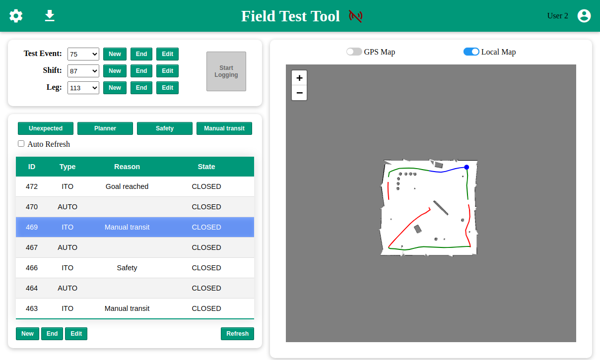

# Field Test Tool (FTT)

The purpose of this tool is to monitor and analyze the switching events between autonomous mode and manual mode on autonomous ground vehicles. This is done by collecting relevant data from the robot's ROS environment, alongside context data provided by users.
The collected data is processed by an automatic report generator, which aims to help the manufacturer, the project manager and the customer to analyze software issues in certain enviroments.

If you use this code in an academic context, please cite the following work:
```
@inproceedings{9784813,
  author={Tampier, Carlos and Tiderko, Alexander and Schneider, Frank E.},
  booktitle={2022 IEEE International Conference on Autonomous Robot Systems and Competitions (ICARSC)}, 
  title={Field Test Tool: automatic reporting and reliability evaluation for autonomous ground vehicles}, 
  year={2022},
  pages={73-78},
  doi={10.1109/ICARSC55462.2022.9784813}}

```

## _1. Description_

The Field Test Tools comprises five software modules:
- A PostgreSQL database with PostGIS extension. 
- An automatic report generator out of the stored data.
- A web server that exposes a JSON API for the database and report generator.
- A ROS interface to the server API and the web user interface.
- A web user interface to the server API and the ROS interface.
<br/><br/>

A detailed explanation of each component is presented below. Operating instructions are also available under the ```doc``` directory of this repository.

<details>

<summary>Show detailed description</summary>

### **1.1. Database**

A PostgreSQL database with PostGIS extension is used to store the relevant data. The databse schema is shown in Figure 1. The robot's position, operating mode, images and user notes are stored under a hierarchical logging structure representing the trial instance (Test Event), test attempt (Shift), and route section (Leg). Each trajectory under a single operating mode comprises a Segment entry.

<figure>
  
  <figcaption>Figure 1. Database schema.</figcaption>
</figure>
<br/><br/>

In addition to the data tables (Test Event, Shift, Leg, Segment, Map Image, Pose, Local Pose, Image and Note), which are used to store user- or robot-generated field data, a number of configuration tables complete the database schema. This configuration tables are divided in static (Weather, ITO Reason, Segment Type) and user-defined (Personnel, Performer, Vehicle, Pose Source). While the latter are designed to contain use-case specific information, the former are completely defined upon database initialization and contain a standardized set of options, from which the user can select when configuring the experimental setup. These options are shown below.
<br/><br/>

Table 1: Weather configuration table data.
| Key      |	Description                                                               |
| -------- | -------------------------------------------------------------------------- |
| sunny    |	Mainly sunny, less than 30 percent of the sky is covered by clouds.       |
| cloudy   |	Mainly cloudy, between 30 and 95 percent of the sky is covered by clouds. |
| overcast |	More than 95 percent of the sky is covered by clouds.                     |
| foggy    |	Reduced visibility due to fog to less than one kilometer.                 |
| rainy    |	-                                                                         |
| snowy    |	-                                                                         |

<br/><br/>

Table 2: ITO Reason configuration table data.
| Key	           | Description                                                                                           |
| -------------- | ----------------------------------------------------------------------------------------------------- |
| safety         |	Safety stop, initiated by an inhabitant of the vehicle.                                              |
| maintenance    |	Maintenance stop, a stop initiated by the performer to fix code.                                     |
| planner        |	Planner stop, a stop caused by a timeout or error of the planner.                                    |
| apparatus      |	Apparatus stop, a stop that is initiated by the test admin to fix the test apparatus.                |
| non_stop       |	Non-Stop, indicates that no stop was performed. Ignore this ITO.                                     |
| stereo         |	Stereo test stop, a stop initiated to perform a test of the stereo accuracy.                         |
| goal           |	Goal reached, a stop because the vehicle reached an (intermediate) goal.                             |
| end_shift      |	End of shift indicates the stop was caused because the time for the shift was up.                    |
| manual_transit |	Manual transit indicates that the vehicle was stopped to drive it manually through a dangerous area. |
| other          |	Other reasons.                                                                                       |
| unassigned     |	Unassigned.                                                                                          |
| unexpected     |	Unexpected, non safety-critical behavior.                                                            |

<br/><br/>

Table 3: Segment Type configuration table data.
| Key	 | Description                              |
| ---- | ---------------------------------------- |
| ito	 | ITO - inhabited take over (manual mode). |
| auto | Autonomous.                              |

<br/><br/>

### **1.2. Report generator**
A python script that reads and processes the stored data, then generates and compiles a LaTeX report. The report includes an overview of the robot's path and a timeline of the operating modes, as shown in Figures 2 and 3. Details for each individual segment (path section) are also annotated.

<figure>
  
  <figcaption>Figure 2. FTT report overview (map).</figcaption>
</figure>
<br/><br/>

<figure>
  
  <figcaption>Figure 3. FTT report overview (timeline).</figcaption>
</figure>
<br/><br/>

### **1.3. Web server**

A python script implements a JSON API with the common requests (POST, PUT, GET) to interact with the database tables through HTTP messages. It also serves the main HTML pages and provides an interface to call and get the automatically generated report.
<br/><br/>

### **1.4. ROS interface**

A C++ ROS node that fetches the robot data to create database entries. The following data are subscribed:

| Data                          | Type                       |
| ----------------------------- | -------------------------- |
| Operation mode                | std_msgs/msg/Bool          |
| GPS position                  | sensor_msgs/msg/NavSatFix  |
| Local position                | TF (map -> robot frame)    |
| Environment map               | nav_msgs/msg/OccupancyGrid |
| Camera image                  | sensor_msgs/msg/Image      |

<br/><br/>

Additionally, the node advertises the following services to interact with the web user interface:

| Service              | Description                                          |
| -------------------- | ---------------------------------------------------- |
| /ftt_ros/set_status  | Starts/stops sending robot data to the database      |
| /ftt_ros/get_status  | Returns the current logging status (active/inactive) |
| /ftt_ros/save_params | Write the node parameters to the config file         |

<br/><br/>

### **1.5. Web user interface**

A JavaScript web application that implements a graphical user interface to create new logging instances and append valuable context information. Feedback on the stored robot position data and operating mode is also displayed.
Figures 4 and 5 show an overview of the FTT web GUI displaying GPS and local position, respectively. The data was generated using Clearpath's Husky ROS stack.

<figure>
  
  <figcaption>Figure 4. FTT web GUI overview with GPS data.</figcaption>
</figure>
<br/><br/>

<figure>
  
  <figcaption>Figure 5. FTT web GUI overview with local data.</figcaption>
</figure>
<br/><br/>

</details>

## _2. System requirements_

- Ubuntu 24.04 and ROS Jazzy.
- Current version of a web browser, at least<sup>\*</sup>:
  - Chrome 89+
  - Firefox 86+
  - Safari 14+

<span style="font-size:smaller">\* Older destop versions might also work fine, but mobile ones probably won't.</span>
<br/><br/>

## _3. Installation_

### **3.1. Installation with script**

Simply clone the repository and run the installation script:

```bash
cd <ros_workspace>/src
git clone https://github.com/fkie/field_test_tool.git
cd field_test_tool
./install.sh
```

It will install the required dependencies, build the ros nodes and the web server, and link the ```run.sh``` script in the ```.local/bin``` directory, so that the complete Field Test Tool can be then invoked with the command ```field-test-tool```.

A step-by-step installation without the script is presented below.

<details>

<summary>Show step-by-step instructions</summary>

#### **3.1.1. Installation of Python libraries**

```bash
sudo apt install build-essential python3-pyproj python3-jinja2 python3-parse python3-lxml python3-ruamel.yaml python3-matplotlib python3-numpy python3-tk python3-opencv libopencv-dev libyaml-cpp-dev libcurl4-openssl-dev python3-requests python3-pil python3-psycopg2 python3-flask python3-flask-restful python3-flask-cors
```

#### **3.1.2. Installation of LaTeX and libraries**

```bash
sudo apt install texlive texlive-lang-german texlive-latex-extra texlive-fonts-extra texlive-xetex
```

#### **3.1.3. Installation of the Field Test Tool**

```bash
cd <ros_workspace>
rosdep install --from-paths src/field_test_tool/ --ignore-src
colcon build --symlink-install
```

#### **3.1.4. Installation of PostgreSQL server**

```bash
sudo apt install postgresql postgresql-client postgis
```

#### **3.1.5. Configuration of PostgreSQL**

Navigate to the FTT database directory and execute the setup script:

```bash
cd <ros_workspace>/src/field_test_tool/ftt_database/postgres
./setup_ftt_db.sh
```

The script will roughly do the following:

1. Login to Postgres.

```bash
sudo -u postgres psql
```

2. Set password for user postgres.

```psql
\password postgres
postgres
postgres
```

3. Create the FTT database:

```psql
CREATE DATABASE ftt;
```

4. Enable postgis and postgis_topology extensions for the FTT database and quit:

```psql
\c ftt
CREATE EXTENSION postgis;
CREATE EXTENSION postgis_topology;
\q
```

5. Create the database schema and fill some tables with the required values:

```bash
cd <ros_workspace>/src/field_test_tool/ftt_database/postgres
psql -U postgres -h localhost -d ftt -a -f ftt_schema.sql
psql -U postgres -h localhost -d ftt -a -f setup_queries.sql
```

Alternative: If postgres server is on a different host:

```bash
cd <ros_workspace>/src/field_test_tool/ftt_database/postgres
psql -h <hostname> -d ftt -U postgres -p 5432 -a -q -f ftt_schema.sql ftt
psql -h <hostname> -d ftt -U postgres -p 5432 -a -q -f setup_queries.sql ftt
```

#### **3.1.6. Installation texmaker (optional)**

Texmaker is an editor of LaTeX files.

```bash
sudo apt install texmaker
```

#### **3.1.7. Installation pgAdmin 4 (optional)**

PgAdmin is a management software for the PostgreSQL-database. Follow the installation instruction from the [pgAdmin's website](https://www.pgadmin.org/download/pgadmin-4-apt/)

#### **3.1.8. Installation of the FTT Web GUI**

Once cloned, the repository already contains all the files ready for the web server to serve the web application. **However**, to further develop, make changes to the JavaScript code or use the application in offline mode, certain tools/libraries will be needed and the following steps will walk you through the installation process.

The tools will basically allow you to **build** the separate JavaScript files into a single script, which could then also be optimized for browser execution. The download of the extra libraries will allow **offline** execution of the application.

**Alternatively**, the whole application can be made to work **_without_** the extra tools or libraries. Beware though, that this means loosing the optimization and script merging capabilities as well as offline usage.

To work without the extra tools, respectively change the following lines in index.html and config.html:

```html
<script src="assets/scripts/index.js" defer type="module"></script>
```

```html
<script src="assets/scripts/config.js" defer type="module"></script>
```

For:

```html
<script src="src/index.js" defer type="module"></script>
```

```html
<script src="src/config.js" defer type="module"></script>
```

Otherwise, proceed with the installation steps below.
<br/><br/>

##### **3.1.8.1. Installation of Node.js**

Install the latest version of Node.js for you machine from https://nodejs.org. This will give you access to the **_npm_** package manager needed for the next steps.
<br/><br/>

##### **3.1.8.2. Installation of npm libraries**

The following npm libraries (and their dependencies) will be installed:

| Name                       | Description                                 |
| -------------------------- | ------------------------------------------- |
| ESLint v7.17.0             | Linting for your JS code.                   |
| Html Webpack Plugin v4.5.1 | Webpack plugin to work with multiple HTMLs. |
| Webpack v4.46.0            | Script bundling and workflow managing.      |
| Webpack CLI v3.3.9         | Webpack set of commands for developing.     |
| Webpack Dev Server v3.11.2 | Webpack simple serving for applications.    |
| Material Icons             | Offline use of Google icons.                |
| Leaflet                    | Offline use of Leaflet map viewer.          |
| Easeljs                    | Offline use of Easeljs graphics library.    |

To install them, simply navigate to your project directory and run the following npm command:

```bash
cd <ros_workspace>/src/field_test_tool/ftt_web_interface

npm install
```

##### **3.1.8.3. Installation of ESLint (optional for VS Code)**

If you're working with VS Code, linting can be made available for this project to help with development. To do this, install the ESLint extension from the extensions tab of VSCode and enable it.

Linting will be shown according to the rules set in the _.eslintrc.json_ file.
<br/><br/>

##### **3.1.8.4. Useful npm commands**

From the project directory ```<ros_workspace>/src/field_test_tool/ftt_web_interface``` the following npm commands are conveniently available:

| Command            | Description |
| ------------------ | ----------- |
| npm run build      | Bundles the different scripts and builds index.js and config.js under the assets/scripts folder. |
| npm run build:dev  | Bundles the scripts and starts a development server to serve the applications at ```localhost:8080```. </br>**Warning**: Since the web app is meant to be served from the same server as the database API,</br>the app won't work properly unless the server address is manually changed in ```src/utility/ServerInterface.js```. |
| npm run build:prod | Just like build, but the built scripts are also optimized for production. |

</details>

### **3.2. Installation with Docker**

The project includes Docker files and a docker-compose file to speed up the deployment of the application for testing purposes.

First, make sure to have [Docker](https://docs.docker.com/engine/install/ubuntu/) installed on your machine or follow the official documentation to install them. Then, simply step in the project's directory and run docker compose:
```
cd <ros_workspace>/src/field_test_tool

docker compose up
```

Doing so will build and start three docker containers:
  * One for the FTT ROS interface node, with access to all network ports<sup>\*</sup>.
  * One for the FTT server and web interface (back- and front-end), with access to port 5000.
  * One for the FTT database (access only to docker's internal network).

\***Note**: In order for the ROS nodes in the container to be able to communicate with nodes from the host machine, the following environmental variables must be used in the host machine (conversely the values could be changed in the docker-compose file). 
```
RMW_IMPLEMENTATION=rmw_fastrtps_cpp && ROS_DOMAIN_ID=0
```

The input source code is made available to the docker containers via volume mounting. Likewise, a volume is mounted in the FTT database directory of the host environment for the database structure.

With the docker containers running, the execution steps from sections [4.1](#41-ftt-server) and [4.2](#42-ftt-ros-interface) can be skipped.
<br/><br/>

## _4. Execution_

If you installed the Field Test Tool with the installation script, you can start the FTT server and ROS nodes with the command:

```bash
field-test-tool
```

Then skip to [Section 4.3](#43-ftt-web-gui).

### **4.1. FTT server**

The following commands starts the web server:

```bash
cd <ros_workspace>/src/field_test_tool/ftt_server/scripts/

python3 api.py
```

### **4.2. FTT ROS interface**

The following command launches the ROS data collector for sending the operation mode, GPS position, local map and base link position data. Additionally, the rosbridge_server's rosbrige_websocket launcher file will be executed, allowing direct communication between the ROS environment and the web application.

```bash
ros2 launch ftt_ros_interface ftt_ros.launch.xml
```
The launch file will load the parameters in the YAML file of the package's configuration folder (details below) and then run the ROS node.
This node will initially only advertise three configuration services (_/ftt_ros/set_status_, _/ftt_ros/get_status_, _/ftt_ros/save_params_).

The service "set_status" is used to start or stop the POSTing of data to the FTT server/database, the service "get_status" returns the current state of logging activity (active: true or inactive: false), and "save_params" can be used to store the - potentially updated - node's parameters in the ROS parameters server, back to the YAML configuration file.

| Service              | Type             |
| -------------------- | ---------------- |
| /ftt_ros/set_status  | std_srvs/SetBool |
| /ftt_ros/get_status  | std_srvs/Trigger |
| /ftt_ros/save_params | std_srvs/Trigger |

Once the logging is activated, the node's parameters are read, the subscribers for the robot data are created and the POSTing to the FTT server starts executing. Specifically, the following topics are subscribed (**Note**: the topic names are specified in the node's parameters, which can also be modified via the FTT web GUI, as explained in the specific documentation).

| Topic                         | Type                        |
| ----------------------------- | --------------------------- |
| robot_mode                    | std_msgs/msg/Bool   |
| gps_fix                       | sensor_msgs/msg/NavSatFix       |
| local_pose                    | geometry_msgs/msg/PoseStamped   |
| map                           | nav_msgs/msg/OccupancyGrid      |
| image                         | sensor_msgs/msg/Image           |

<br/><br/>

Additionally, a TF listener is started to get the robot's position (_robot_frame_ parameter) in the local coordinate frame (_map_frame_ parameter). 

**Note**: For system with limited resources, it is recommended to prevent the execution of the TF listener if the logging of the local robot position is not required. This is done by setting the node's _use_tf_ parameter to _false_.
<br/><br/>

#### **4.2.1 FTT ROS interface extras**

Some extra utility ROS nodes are provided:

- robot_mode_publisher (Python): This node subscribes to two velocity command topics (of type _geometry_msgs/msg/TwistStamped_), one expected to come from the autonomous navigation stack and the other from a joystick interpreter. It then identifies the operation mode and publishes messages of type std_msgs/msg/Bool accordingly. The autonomous mode (True) is flagged at the arrival of autonomous command messages. The publised message switches to manual mode (False) the moment a non-zero joystick command message arrives. After joystick messages stop, a fixed time (parameter) must elapse before returning to the autonomous mode if navigation commands are still being received. This timeout routine is implemented in order to prevent unwanted switching between modes.

  To launch the robot_mode_publisher, the following command can be used (parameters in the launch file):
  ```bash
  ros2 launch ftt_ros_interface robot_mode_publisher.launch.xml <args>
  ```

### **4.3. FTT web GUI**

After running the FTT server API, visit http://localhost:5000/ from your web browser (alternatively, the IP address of the machine running the server). Usage instructions can be found under the ```doc``` directory of this repository.
<br/><br/>

### **4.4. PDF-Report generator**

The report generator can be directly called from within the web GUI, but if you want to manually do it, it can be achieved with the following commands. The output PDF report will be available at ```<ros_workspace>/src/field_test_tool/ftt_report_generator/build/report.pdf```. The report configuration options are explained below.

```bash
cd <ros_workspace>/src/field_test_tool/ftt_report_generator/src/

python3 db2rep.py <path_to_config_file> (e.g. ../config/2021_fkie_test.xml)
```

### **4.5. FTT database**

Usually, you won't need to directly interact with the database after its initial setup, but the ```ftt_database``` folder of the repository does include a utility Python script called ```mergeDbs.py```. This script can be used to copy the data stored in a source ftt database (e.g. running in your robot) to a target ftt database (e.g. running in your development PC). To run it, just specify the connection information for both databases as arguments to the program:
```bash
cd <ros_workspace>/src/field_test_tool/ftt_database/scripts/
python3 mergeDbs.py "host=<source_system_ip> dbname=ftt user=postgres password=postgres" "host=<target_system_ip> dbname=ftt user=postgres password=postgres"
```

Alternatively, a database dump file can be passed as the source argument:
```bash
python3 mergeDbs.py "<path_to_db_dump_file>" "host=<target_system_ip> dbname=ftt user=postgres password=postgres"
```
<br/><br/>

## _5. FTT ROS node parameters_

The FTT ROS interface node has its parameters loaded from a YAML file in the package's configuration folder. These parameters are explained below. Please note that some parameters are only used in the Python implementation of the node.

| Parameter Name           | Default Value    | Description                                                              |
| ------------------------ | ---------------- | ------------------------------------------------------------------------ |
| topics/robot_mode        | robot_mode       | Name of the topic for robot operating mode.                              |
| topics/gps_fix           | gps_fix          | Name of the topic for GPS position data.                                 |
| topics/local_pose        | local_pose       | Name of the topic for robot local position data.                         |
| topics/map               | map              | Name of the topic for the map of the environment.                        |
| topics/map_jpeg          | map_jpeg         | Name of the topic for the map image (must be the same map as the above). |
| topics/image             | image            | Name of the topic for robot frontal camera (raw) images.                 |
| topics/image_compressed  | image_compressed | Name of the topic for robot frontal camera (compressed) images.          |
| params/use_tf            | true             | Flag to create a TF listener to extract the robot's local position.      |
| params/map_frame         | map              | Name of the map frame for the tf listener.                               |
| params/robot_frame       | base_link        | Name of the base link frame for the tf listener.                         |  
| params/server_address    | localhost:5000   | Database API server IP and port.                                         |
| params/send_pose_period  | 2.0              | Time period for sending position data to the database.                   |
| params/send_map_period   | 2.0              | Time period for sending map data to the database.                        |
| params/image_buffer_size | 3                | Number of images keep in buffer.                                         |
| params/image_buffer_step | 1.0              | Minimum time interval between buffered images.                           |

<br/><br/>

### **5.1 Extra nodes parameters**

The robot_mode_publisher node also requires some parameters to be set when using it. Unlike the ftt_ros node, these are set directly in the launcher file: robot_mode_publisher.launch.xml.

| Parameter Name   | Description                                                                                           |
| ---------------- | ----------------------------------------------------------------------------------------------------- |
| joy_cmd_topic    | ROS topic for joystick velocity command messsages of type _geometry_msgs/msg/TwistStamped_.           |
| nav_cmd_topic    | ROS topic for navigation velocity command messsages of type _geometry_msgs/msg/TwistStamped_.         |
| robot_mode_topic | ROS topic for robot operating mode of type _std_msgs/msg/Bool_. True = Autonomous, False = Manual.    |
| joy_cmd_timeout  | Parameter to set the mininum time to switch out of manual mode after joystick commands stop arriving. |
| publish_period   | Parameter to set the interval time for publishing robot mode messages.                                |

<br/><br/>

## _6. Report Generator Configuration File_

The report generator script requires an XML file with the following structure:

```xml
<testevent>

  <resource tile_server = "<server_dir>" zoom_level = "<integer>"/>

  <postgis host = "localhost" dbname="ftt" user ="postgres" password = "postgres"/>

  <report name="<report_name>" version="<version>">
    <test_event id="<test_event_id>" min_dur="<min_duration_in_hours>" local="<true/false>"/>
    <recipient name="<name>" address="<address>"/>
    <creator name="<name>" address="<address>"/>
    <logos top_logo_path = "<path_to_front_page_top_logo>" bottom_logo_path = "<path_to_front_page_bottom_logo>"/>
  </report>

</testevent>
```

Most of the parameters are self-explanatory, but the following should be noted:

- The **_server_dir_** parameter expects a URL to a tile server with an API that considers the _x_ and _y_ coordinates, and _zoom_ (z) of the requested tile. The URL should be parameterized as follows: **http://your.tile.server/{z}/{x}/{y}**. An example would be _<span>http://a.tile.openstreetmap.org/{z}/{x}/{y}.png</span>_.
- The **_zoom_level_** parameter sets the zoom level used for fetching the tiles from the tile server.
- The **_report_name_** and **_version_** parameters are simply for the text to be displayed on the front page of the report.
- The **_test_event_id_** parameter specifies the test event for which the information will be processed and written to the report.
- The **_local_** parameter controls the usage of either locally referenced positions or GPS data.
- The **_min_dur_** parameter is simply used to set a minimum length for the timeline generated in the report and the number should be specified in hours.

<br/><br/>

## _7. Offline usage of the web GUI (local tile server)_

Completing the installation steps for the web GUI enables the offline usage of the application on your machine, the one **exception** being the tile server.

A tile server is needed for the leaflet map viewer in the FTT. By default, OpenStreetMap is used. Without internet access, a local tile server must be configured. 

### **7.1. Configuring a tile server with OSM data**

A guide on how to do this can be found at:

- https://switch2osm.org/serving-tiles/manually-building-a-tile-server-18-04-lts

A docker container is also available at:

- https://github.com/Overv/openstreetmap-tile-server

### **7.2. Configuring a tile server with a GeoTIFF image**

Serving tiles from a GeoTIFF image is easier done with the [GeoServer](https://geoserver.org/) tool. A handy docker container can be found at:

- https://github.com/kartoza/docker-geoserver

That repository includes sample docker-compose.yml and .env files to quicky configure and install the application. Once installed, the GeoServer needs to be set up to serve tiles from the GeoTIFF image. The following steps will walk you through this process.

1. Move your GeoTIFF data to the GeoServer docker image data volume. This is easier done by modifying the docker-compose file to mount the volume in a local rounte of the host machine, e.g. by changig:
    ```
    geoserver:
      volumes:
        - geoserver-data:/opt/geoserver/data_dir
    ```
    To:
    ```
    geoserver:
      volumes:
        - ./geoserver_data:/opt/geoserver/data_dir
    ```
    And then creating a directory called `geoserver_data` in the same location as your docker-compose file.

2. Set up a Workspace in the GeoServer. Go to the GeoServer home page (`http://localhost:8600/geoserver` by default in the sample configuration) and log in using your credentials (by default, user: `admin`, password: `myawesomegeoserver`). On the left side, click on `Workspaces` then `Add new workspace`. You can choose a name and URI, such as `ftt` and `http://localhost:8600/geoserver/ftt`, then click `save`.

3. Set up a Store. Again on the left side, click on `Store`, then `Add new store`. Select `GeoTIFF` as the data source type. Pick a data source name, write a description and browse for your .tiff image. Click `save`. 

4. Set up a Layer. On the page that opens after step 3, click on `Publish`. Change the `Name` of the layer to something simple (e.g. `MyLayer`), then click on `save` at the bottom of the page. 

5. Set up Tile Caching. Once again on the left side, click on `Tile Layers`. Select your newly created layer (ftt:MyLayer in this example) and under the `Tile Caching` tab, near the bottom of the page, expand the list for `Add grid subset`. Type and select `WebMercatorQuad` and click on the plus icon on the right to add it. Click `save`.

6. You can now fetch the tiles using the following URL format (note that this may vary depending on your workspace and layer name).

    - http://localhost:8600/geoserver/gwc/service/tms/1.0.0/ftt:MyLayer/{z}/{x}/{y}.png?flipY=true

<br/><br/>

## _8. Acknowledgements_

The following libraries and resources are needed for this project. They are shown alongside their respective license.

| Name                       | License                                 | URL                                                                          |
| -------------------------- | --------------------------------------- | ---------------------------------------------------------------------------- |
| rospy                      | Apache-2.0 License                      | https://github.com/ros2/rclpy/blob/rolling/LICENSE                           |
| rclcpp                     | Apache-2.0 License                      | https://github.com/ros2/rclcpp/blob/rolling/LICENSE                          |
| std_msgs                   | Apache-2.0 License                      | https://github.com/ros2/common_interfaces/blob/rolling/std_msgs/LICENSE      |
| sensor_msgs                | Apache-2.0 License                      | https://github.com/ros2/common_interfaces/blob/rolling/sensor_msgs/LICENSE   |
| geometry_msgs              | Apache-2.0 License                      | https://github.com/ros2/common_interfaces/blob/rolling/geometry_msgs/LICENSE |
| nav_msgs                   | Apache-2.0 License                      | https://github.com/ros2/common_interfaces/blob/rolling/nav_msgs/LICENSE      |
| cv_bridge                  | Apache-2.0 and BSD-3-Clause License     | https://github.com/ros-perception/vision_opencv                              |
| tf2_ros                    | BSD-3-Clause License                    | https://github.com/ros2/geometry2/blob/rolling/LICENSE                       |
| Python Standard Library    | PSF License                             | https://docs.python.org/2/license.html                                       |
| requests                   | Apache-2.0 License                      | https://github.com/psf/requests/blob/master/LICENSE                          |
| ruamel.yaml                | MIT License                             | https://sourceforge.net/p/ruamel-yaml/code/ci/default/tree/LICENSE           |
| Pillow                     | HPND License                            | https://github.com/python-pillow/Pillow/blob/master/LICENSE                  |
| psycopg2                   | GNU Lesser General Public License       | https://www.psycopg.org/license/                                             |
| Flask                      | BSD-3-Clause License                    | https://github.com/pallets/flask/blob/master/LICENSE.rst                     |
| Flask-restful              | BSD-3-Clause License                    | https://github.com/flask-restful/flask-restful/blob/master/LICENSE           |
| Flask-cors                 | MIT License                             | https://github.com/corydolphin/flask-cors/blob/master/LICENSE                |
| LXML                       | BSD-3-Clause License                    | https://github.com/lxml/lxml/blob/master/LICENSE.txt                         |
| jinja2                     | BSD-3-Clause License                    | https://github.com/pallets/jinja/blob/master/LICENSE.rst                     |
| parse                      | MIT License                             | https://github.com/r1chardj0n3s/parse/blob/master/LICENSE                    |
| pyproj                     | MIT License                             | https://github.com/pyproj4/pyproj/blob/master/LICENSE                        |
| Matplotlib                 | PSF-based License                       | https://github.com/matplotlib/matplotlib/blob/main/LICENSE/LICENSE           |
| NumPy                      | BSD License                             | https://numpy.org/doc/stable/license.html                                    |
| GNU C++ Standard Library   | GPLv3 License                           | https://gcc.gnu.org/onlinedocs/libstdc++/manual/license.html                 |
| OpenCV                     | BSD-3-Clause or Apache-2.0 License      | https://opencv.org/license                                                   |
| cpr                        | MIT License                             | https://github.com/libcpr/cpr/blob/master/LICENSE                            |
| nlohmann json              | MIT License                             | https://github.com/nlohmann/json/blob/develop/LICENSE.MIT                    |
| yaml-cpp                   | MIT License                             | https://github.com/jbeder/yaml-cpp/blob/master/LICENSE                       |
| Leaflet                    | 2-clause BSD License                    | https://github.com/Leaflet/Leaflet/blob/master/LICENSE                       |
| OpenStreetMap<sup>\*</sup> | Open Data Commons Open Database License | https://www.openstreetmap.org/copyright                                      |
| Google Material Icons      | Apache-2.0 License                      | https://www.apache.org/licenses/LICENSE-2.0.txt                              |
| Webpack                    | MIT License                             | https://github.com/webpack/webpack/blob/master/LICENSE                       |
| Webpack CLI                | MIT License                             | https://github.com/webpack/webpack-cli/blob/master/LICENSE                   |
| Webpack Dev Server         | MIT License                             | https://github.com/webpack/webpack-dev-server/blob/master/LICENSE            |
| HTML Webpack Plugin        | MIT License                             | https://github.com/jantimon/html-webpack-plugin/blob/main/LICENSE            |
| Easeljs                    | MIT License                             | https://github.com/CreateJS/EaselJS/blob/master/LICENSE.txt                  |
| Roslibjs                   | BSD License                             | https://github.com/RobotWebTools/roslibjs/blob/develop/LICENSE               |
| Ros2djs                    | BSD License                             | https://github.com/RobotWebTools/ros2djs/blob/develop/LICENSE                |

<span style="font-size:smaller">\* © OpenStreetMap contributors. Base map and data from OpenStreetMap and OpenStreetMap Foundation.</span>